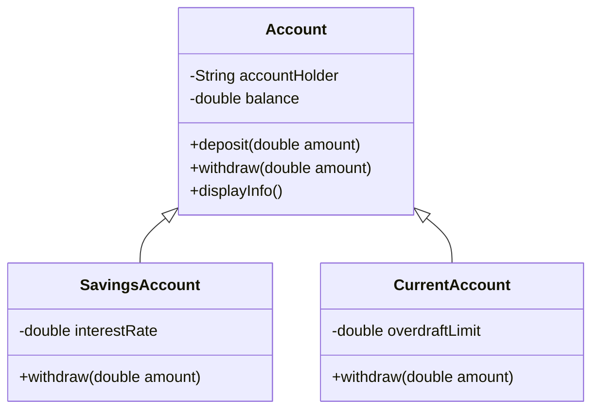

# **OOP Concepts in Java**

## **Introduction**
Object-Oriented Programming (OOP) is a programming paradigm that revolves around the concept of **objects**. Java, as an OOP language, enables developers to design programs around real-world entities. The core principles of OOP are:

1. **Encapsulation**
2. **Inheritance**
3. **Polymorphism**
4. **Abstraction**

---

## **OOP Concepts Overview**

| Concept        | Description | Real-World Analogy | Example in Code |
|----------------|-------------|--------------------|-----------------|
| **Encapsulation** | Hides internal details and provides controlled access through public methods. | A **bank account**, where only the user or authorized personnel can access the balance using proper methods. | Private fields and getter/setter methods. |
| **Inheritance** | Allows one class to inherit the properties and methods of another class. | A **child inherits** traits from their parents. | `SavingsAccount` inherits from `Account`. |
| **Polymorphism** | One function behaves differently based on the object calling it. | A **vehicle's horn** sounds different for different vehicles (bike, car). | Overriding the `withdraw()` method in child classes. |
| **Abstraction** | Hides complex logic and provides only essential details. | A **coffee machine**, where you only press buttons without knowing the internal working. | Declaring an abstract `Account` class. |

---

## **Banking System Example**
This simple example demonstrates all the core OOP concepts:

1. **Encapsulation**: Account balance is private.
2. **Inheritance**: `SavingsAccount` and `CurrentAccount` extend `Account`.
3. **Polymorphism**: `withdraw()` behaves differently in `SavingsAccount` and `CurrentAccount`.
4. **Abstraction**: Users interact with `Account` objects without knowing internal logic.

---

### **Class Diagram**

Below is a class diagram that helps visualize the relationship between the classes in our example:



---

## **Code Snippet**

```java
// Abstract class Account
abstract class Account {
    private double balance;

    public Account(double initialBalance) {
        this.balance = initialBalance;
    }

    public double getBalance() {
        return balance;
    }

    public void deposit(double amount) {
        balance += amount;
        System.out.println("Deposited: " + amount);
    }

    public abstract void withdraw(double amount);
}

// SavingsAccount inherits from Account
class SavingsAccount extends Account {
    public SavingsAccount(double initialBalance) {
        super(initialBalance);
    }

    @Override
    public void withdraw(double amount) {
        if (amount <= getBalance()) {
            System.out.println("Withdrawal successful from Savings Account");
        } else {
            System.out.println("Insufficient funds.");
        }
    }
}
```

---

## **Explanation of OOP Concepts**

### **1. Encapsulation**
- Fields like `balance` are marked **private** and can only be accessed using **public methods** (e.g., `getBalance()` and `deposit()`).

### **2. Inheritance**
- The `SavingsAccount` class **inherits** from `Account` and reuses its methods (like `deposit()`).

### **3. Polymorphism**
- The `withdraw()` method is **overridden** in `SavingsAccount` to provide specific withdrawal behavior.

### **4. Abstraction**
- The `Account` class is **abstract**, hiding unnecessary details from the user while ensuring that subclasses implement the necessary logic.

---

## **UML Class Diagram Visualization**


---

## **Advantages of OOP in Java**

1. **Modularity**: Code is organized into objects and classes.
2. **Reusability**: Inherited code can be reused across child classes.
3. **Flexibility**: Polymorphism makes code adaptable.
4. **Security**: Encapsulation hides sensitive data from external access.

---

## **Conclusion**
OOP principles help build scalable, maintainable, and organized applications. The **Banking System** example illustrates these principles in action, demonstrating how Java enables efficient programming through encapsulation, inheritance, polymorphism, and abstraction.

