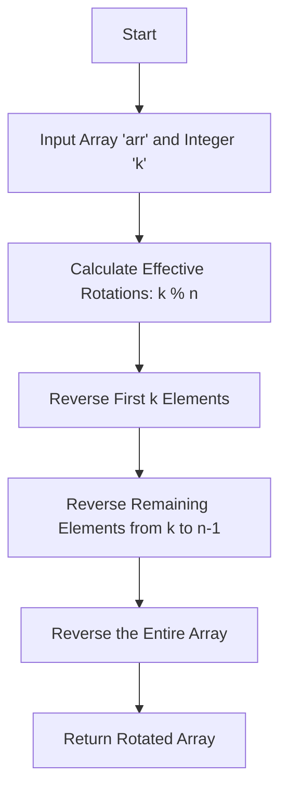

# Array Rotation Problem

## Problem Statement  
Given an array 'arr' with 'n' elements, the task is to rotate the array to the left by 'k' steps, where 'k' is non-negative.

### Example  
- **Input:**  
  `arr` = [1, 2, 3, 4, 5]  
  `k` = 1  
  **Rotated Array:** [2, 3, 4, 5, 1]  
  **For k = 2:** [3, 4, 5, 1, 2]  
  **For k = 3:** [4, 5, 1, 2, 3]  

### Detailed Explanation  
- **Sample Input 1:**  
  ```
  n = 8  
  arr = [7, 5, 2, 11, 2, 43, 1, 1]  
  k = 2  
  ```
  **Sample Output 1:**  
  ```
  Rotated Array: [2, 11, 2, 43, 1, 1, 7, 5]
  ```

  **Explanation:**  
  - Rotate 1 step: [5, 2, 11, 2, 43, 1, 1, 7]  
  - Rotate 2 steps: [2, 11, 2, 43, 1, 1, 7, 5]  

- **Sample Input 2:**  
  ```
  n = 4  
  arr = [5, 6, 7, 8]  
  k = 3  
  ```
  **Sample Output 2:**  
  ```
  Rotated Array: [8, 5, 6, 7]
  ```

### Constraints
- **1 ≤ n ≤ 10³**  
- **1 ≤ arr[i] ≤ 10⁹**  
- **1 ≤ k < n**  

### Expected Time Complexity  
O(n), where ‘n’ is the size of the input array ‘arr’ and ‘k’ is the number of rotations.

---

## Approach

1. **Handling Rotations:**  
   - If `k > n`, take `k = k % n` to reduce unnecessary rotations.
   - The problem can be solved efficiently by reversing sections of the array.

2. **Rotation in Three Steps:**
   - Reverse the first `k` elements.
   - Reverse the remaining `n - k` elements.
   - Reverse the entire array to get the rotated array.

---

## Algorithm

1. Take input: an integer `n`, the array `arr`, and the rotation count `k`.
2. Adjust `k` using modulo operation: `k = k % n`.
3. Reverse:
   - First `k` elements.
   - Elements from `k` to `n-1`.
   - The entire array.
4. Return the rotated array.

---

## Pseudocode

```plaintext
FUNCTION rotateArray(arr, k)
    n = length(arr)
    k = k % n

    reverse(arr, 0, k - 1)
    reverse(arr, k, n - 1)
    reverse(arr, 0, n - 1)

    RETURN arr

FUNCTION reverse(arr, start, end)
    WHILE start < end
        SWAP arr[start] WITH arr[end]
        INCREMENT start
        DECREMENT end
```

---

## Web Diagram



---

## Companies Where This Question Is Asked

| Company                         | Logo |
|---------------------------------|------|
| Wells Fargo                     |  |
| LinkedIn                        |  |
| Arcesium                        |  |
| Deutsche Bank                   |  |
| Salesforce                      |  |
| Infosys                         |  |
| Microsoft                       |  |
| Tata Consultancy Services (TCS) |  |
| Wipro                           |  |
| Paytm                           |  |
| Cognizant                       |  |
| Accolite                        |  |
| Deloitte                        |  |
| Zoho Corporation                |  |
| Tesla                           |  |
| KPMG                            |  |
| Virtusa                         |  |

---

## Hints

1. For an index `i`, determine where it will move after `k` rotations.
2. Observe how the positions of elements change after each rotation. Use three-step reversal for optimal performance.
```

