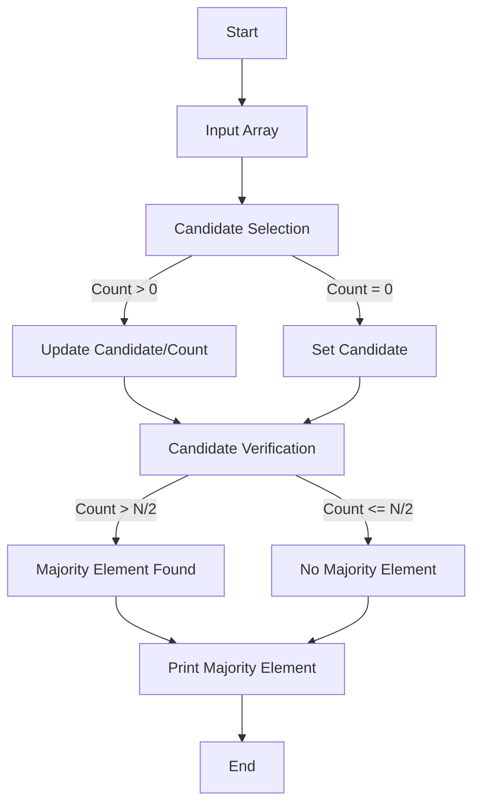

# Majority Element Finder - Problem Documentation

## **Problem Statement**
You are given an array/list `ARR` consisting of `N` integers. Your task is to find the **majority element** in the array. If there is no majority element present, return `-1`.

### **Note**:
- A **majority element** is an element that occurs more than {floor}(N / 2) times in the array.

### **Constraints**:
 1 <= T <= 100 (Number of TestCases)
 1 <= N <= 5 * 10^3 (Size of Array)
 -10^5 <= ARR[i] <= 10^5

### **Input Format**:
1. First line contains the number of test cases (T) .
2. For each test case:
   - First line contains (N), the size of the array.
   - Second line contains (N) integers representing the array elements.

### **Output Format**:
For each test case, output the majority element or `-1` if no majority element exists.

---

## **Approach**

We use **Moore’s Voting Algorithm**, a two-step process:
1. **Candidate Selection**: Identify a potential majority element.
2. **Candidate Verification**: Confirm if the selected candidate satisfies the condition of being a majority element.

---

## **Algorithm**

### **Step 1: Candidate Selection**
1. Initialize `candidate = -1` and `count = 0`.
2. Traverse the array:
   - If `count == 0`, set `candidate = current_element` and `count = 1`.
   - Else if `current_element == candidate`, increment `count`.
   - Else decrement `count`.

### **Step 2: Candidate Verification**
1. Traverse the array to count occurrences of the `candidate`.
2. If the count of `candidate > floor(N / 2)`, it is the majority element.
3. Otherwise, return `-1`.

---

## **Pseudocode**

```text
function findMajorityElement(arr, n):
    candidate = -1
    count = 0

    // Step 1: Candidate Selection
    for num in arr:
        if count == 0:
            candidate = num
            count = 1
        else if num == candidate:
            count += 1
        else:
            count -= 1

    // Step 2: Candidate Verification
    count = 0
    for num in arr:
        if num == candidate:
            count += 1

    if count > floor(n / 2):
        return candidate
    else:
        return -1
```

---

## **Web Diagram**



---

## **Advantages of Moore’s Voting Algorithm**
1. **Optimal Time Complexity**: \( O(N) \) for a single test case.
2. **Space Efficiency**: Uses only \( O(1) \) space.
3. **Scalability**: Handles large datasets efficiently.


## **Sample Input/Output**

### **Input**
```
2
5
2 3 9 2 2
4
8 5 1 9
```

### **Output**
```
Majority Element: 2
Majority Element: -1
```

---

## **Companies Asking This Question**

| Company                         | Logo                                                                                     |
|---------------------------------|------------------------------------------------------------------------------------------|
| ThoughtWorks                    |                         |
| Amazon                          |                                     |
| Google                          |                                     |
| Arcesium                        |                                 |
| Delhivery                       |                               |
| Cognizant                       |                               |
| Paytm                           |                                       |
| Info Edge India (Naukri.com)    |                                     |
| HCL Technologies                |                                      |
| Josh Technology Group           |                    |
| Wipro                           |                                      |
| Smart Energy Water              |                    |
| Accolite                        |                                |
| Rupeek                          |                                    |
| Mahindra Comviva                |                                 |

--- 

This documentation explains the approach, algorithm, and implementation for solving the problem effectively.