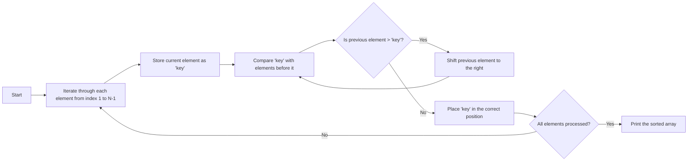

# Sorting an Array Using Insertion Sort

## Problem Statement

You are given ‘N’ integers in the form of an array `ARR`. Your task is to sort the array in-place using the **Insertion Sort** algorithm and print the sorted array.

### Example:
Let `ARR` = [1, 4, 2]  
The sorted array will be: [1, 2, 4]

---

## Detailed Explanation

### Input/Output Format:
- **Input**:
  1. An integer `T` (1 ≤ T ≤ 10) representing the number of test cases.
  2. For each test case:
     - An integer `N` (1 ≤ N ≤ 5000) representing the size of the array.
     - An array `ARR` containing `N` integers (1 ≤ ARR[i] ≤ 10⁵).

- **Output**:
  - For each test case, print the sorted array on a new line.

### Constraints:
- Time Limit: 1 second per test case.

---

## Sample Input and Output

### Input 1:
```text
2
4
3 1 2 2
3
1 4 2
```

### Output 1:
```text
1 2 2 3
1 2 4
```

### Input 2:
```text
2
4
4 12 11 20
6
6 5 4 3 2 1
```

### Output 2:
```text
4 11 12 20
1 2 3 4 5 6
```

---

## Explanation of Sample Cases

### Test Case 1:
- **Input**:  
  ARR = [3, 1, 2, 2]  
  **Sorting Steps**:
  - Insert `1` in its correct position → `[1, 3, 2, 2]`
  - Insert `2` in its correct position → `[1, 2, 3, 2]`
  - Insert the second `2` in its correct position → `[1, 2, 2, 3]`  
  **Output**: 1 2 2 3

### Test Case 2:
- **Input**:  
  ARR = [6, 5, 4, 3, 2, 1]  
  **Sorting Steps**:
  - Insert `5` in its correct position → `[5, 6, 4, 3, 2, 1]`
  - Insert `4` in its correct position → `[4, 5, 6, 3, 2, 1]`
  - Continue until sorted → `[1, 2, 3, 4, 5, 6]`  
  **Output**: 1 2 3 4 5 6

---

## Approach

1. Use **Insertion Sort**:
   - Traverse the array from the second element.
   - Compare it with the elements before it and shift the larger elements to the right.
   - Insert the current element into its correct position.

2. **Sort in-place**:
   - Modify the array directly without using extra space.

---

## Algorithm

1. Start with the second element (`key`).
2. Compare the `key` with the previous elements (`arr[j]`).
3. Shift all elements larger than the `key` to the right.
4. Place the `key` in its correct position.
5. Repeat for all elements in the array.

---

## Pseudocode

```text
for i = 1 to N-1:
    key = arr[i]
    j = i - 1

    while j >= 0 and arr[j] > key:
        arr[j + 1] = arr[j]  // Shift element to the right
        j = j - 1

    arr[j + 1] = key  // Place the key in its correct position
```

---

## Web Diagram



---

## Explanation of Insertion Sort

**Concept**:  
Insertion Sort works by maintaining a sorted portion of the array and inserting new elements into their correct position.

**Steps**:
1. Start with the first element (already sorted).
2. Pick the next element.
3. Compare it with elements in the sorted portion and shift them to the right to create space for the new element.
4. Repeat until the entire array is sorted.

---

## Applications of Insertion Sort

- Best for small datasets.
- Efficient for nearly sorted data.
- Used in hybrid algorithms like Timsort.

---

## Companies Asking This Question

| Company Name                                   | Logo                                                                 |
|-----------------------------------------------|----------------------------------------------------------------------|
| Infosys                                       |                |
| Accenture                                     |            |
| Capgemini Consulting India Private Limited   |            |
| Thirdware Solutions                          |            |
| Newgen Software                               |          |
| Mindtree                                      |              |
| HEPAM Systems                                 |             |
| Signzy                                       |                  |


## Time Complexity

| Case       | Complexity | Explanation                           |
|------------|------------|---------------------------------------|
| Best Case  | O(N)       | Array is already sorted.             |
| Worst Case | O(N²)      | Array is sorted in reverse order.    |
| Average    | O(N²)      | Elements are randomly distributed.   |

---

## Space Complexity
- **O(1)**: In-place sorting, no additional space used.