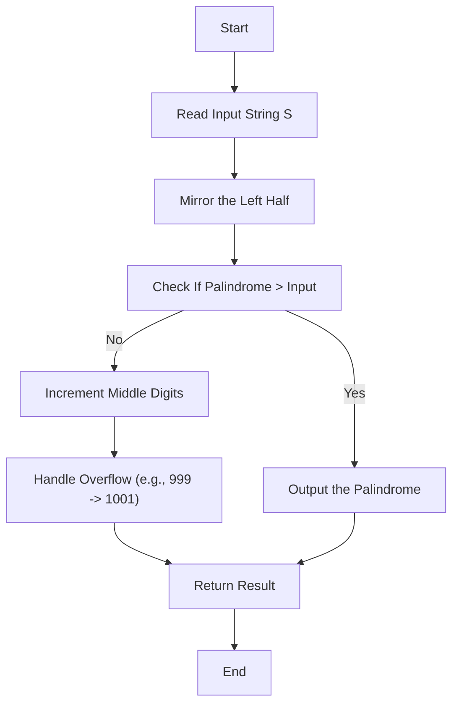

# Smallest Palindrome Greater Than N

## **Problem Statement**
You are given a number 'N' in the form of a string `S`. Your task is to find the smallest palindrome strictly greater than the given number `N`.

### **Key Notes:**
1. A **palindrome** reads the same forward and backward, such as "naman", "abcba", "1234321", etc.
2. The numerical value of `S` is greater than 0.
3. Single-digit numbers are also palindromes.
4. Length of `S` equals the number of digits in `N`.

---

## **Constraints**
- 1 ≤ T ≤ 100 (Number of test cases)
- 1 ≤ len(S) ≤ 10^4 (Length of the number string)

---

## **Sample Input and Output**

| Input                      | Output  |
|----------------------------|---------|
| `1` <br> `4` <br> `1221`   | `1331`  |
| `1` <br> `3` <br> `999`    | `1001`  |

### **Explanation**
- For input `1221`:  
   - The next greater palindrome is `1331` (strictly greater than `1221` and symmetric).
- For input `999`:  
   - The next greater palindrome is `1001`, which involves increasing the number of digits.

---

## **Approach**

To solve this problem efficiently:
1. **Mirror Approach:**  
   Mirror the left half of the number to the right side to form a palindrome.
2. **Comparison:**  
   Check if the generated palindrome is strictly greater than the input. If not, increment the middle part of the number and rebuild the palindrome.
3. **Edge Case:**  
   If the input consists of all 9's (e.g., `999`), the result will be `1001`.

---

## **Algorithm**

1. Read the input string `S` and mirror its left half to construct the first candidate palindrome.
2. Compare this candidate with the input:
   - If the candidate is greater than the input, return it.
   - Otherwise, increment the middle part of the number and rebuild the palindrome.
3. Handle cases where a carry propagates through the entire number (e.g., `999` to `1001`).

---

## **Pseudocode**

```text
function nextPalindrome(S):
    N = length of S
    chars = copy of S as character array
    
    # Step 1: Mirror the left half to form a candidate palindrome
    for i = 0 to N/2:
        chars[N-1-i] = chars[i]  // Mirror left half to right
    
    candidate = join(chars)
    
    # Step 2: Check if the candidate is valid
    if candidate > S:
        return candidate
    
    # Step 3: Increment middle digits and propagate carry
    mid = N / 2
    carry = 1
    for i = mid-1 downto 0:
        digit = chars[i] + carry
        carry = digit / 10
        chars[i] = digit % 10
        chars[N-1-i] = chars[i]  // Maintain palindrome symmetry
    
    # Step 4: Handle carry overflow (e.g., 999 -> 1001)
    if carry > 0:
        result = "1" + "0" * (N-1) + "1"
        return result
    
    return join(chars)
```

---

## **Web Diagram**

The following diagram visually explains the logic flow of solving the problem:



---

## **Code Implementation**

Refer to the Java implementation provided in the previous section.

---

## **Company Table**

The following table lists companies along with their logos fetched from Clearbit.

| **Company Name**   | **Logo**                                      |
|---------------------|----------------------------------------------|
| **Zomato**         |  |
| **Big Basket**     |  |
| **Quikr**          |  |
| **Sprinklr**       |  |
| **Amazon**         |  |
| **Accenture**      |  |
| **MakeMyTrip**     |  |
| **Uber**           |    |
| **VMware Inc**     |  |

---

## **Conclusion**

This solution efficiently generates the smallest palindrome strictly greater than the input by:
1. Mirroring the left half.
2. Incrementing the middle digits if needed.
3. Handling edge cases like `999`.

The approach ensures a time complexity of **O(n)** per test case.